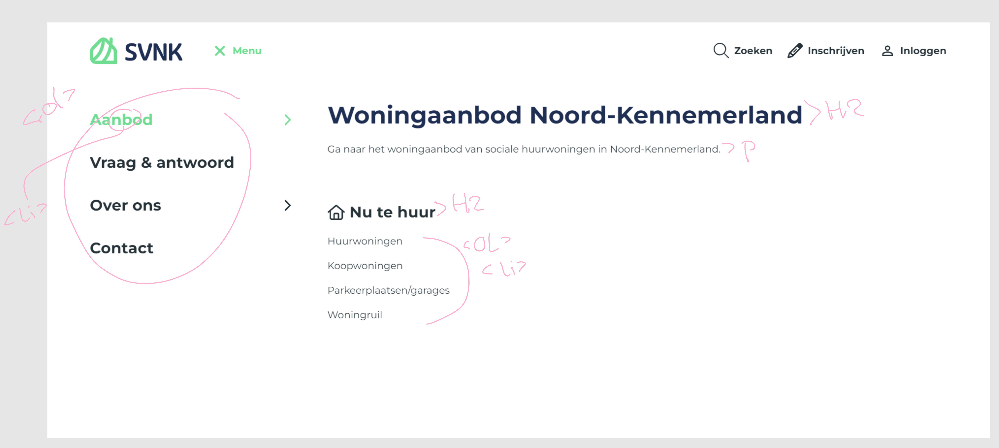

# Procesverslag
Markdown is een simpele manier om HTML te schrijven.  
Markdown cheat cheet: [Hulp bij het schrijven van Markdown](https://github.com/adam-p/markdown-here/wiki/Markdown-Cheatsheet).

Nb. De standaardstructuur en de spartaanse opmaak van de README.md zijn helemaal prima. Het gaat om de inhoud van je procesverslag. Besteedt de tijd voor pracht en praal aan je website.

Nb. Door *open* toe te voegen aan een *details* element kun je deze standaard open zetten. Fijn om dat steeds voor de relevante stuk(ken) te doen.

## Jij

  
uitwerken voor kick-off werkgroep

  ### Auteur:
  Tess Kollof

  #### Je startniveau:
  Blauw

  #### Je focus:
  Responsive
 

## Je website

  
uitwerken voor kick-off werkgroep

  ### Je opdracht:
  https://www.svnk.nl/

  #### Screenshot(s) van de eerste pagina (small screen): 
  hier de naam van de pagina HOME 
  
  

  #### Screenshot(s) van de tweede pagina (small screen):
  hier de naam van de pagina AANBOD
  
  
 

## Toegankelijkheidstest 1/2 (week 1)

  
uitwerken na test in 2e werkgroep 2

  ### Bevindingen
  Lijst met je bevindingen die in de test naar voren kwamen:
  De narrator sloeg verschillende vlakken tekst over, verder zijn bepaalde buttons na het hoveren onleesbaar voor mensen met een visuele beperking.
  Ook is er geen alt tekst toegevoegd bij veel van de afbeeldingen.

## Breakdownschets (week 1)

  
uitwerken na afloop 3e werkgroep

  ### de hele pagina: 
  

  ### dynamisch deel (bijv menu): 
  

## Voortgang 1 (week 2)

  
uitwerken voor 1e voortgang

  ### Stand van zaken
  hier dit ging goed & dit was lastig (neem ook screenshots op van delen van je website en code)
  

  ### Agenda voor meeting
  samen met je groepje opstellen

  | student 1      | student 2          | student 3    | student 4        |
  | ---            | ---                | ---          | ---              |
  | dit bespreken  | en dit             | en ik dit    | en dan ik dat    |
  | en dat ook nog | dit als er tijd is | nog een punt | dit wil ik zeker |
  | ...            | ...                | ...          | ...              |

- Hoe krijg je tekst over plaatjes?
- hoe werken grids, hoe voeg je deze toe aan je website?
- watvoor elementen kun je het beste gebruiken inplaats van een div?

  ### Verslag van meeting
  hier na afloop snel de uitkomsten van de meeting vastleggen

  - punt 1
  - punt 2
  - nog een punt
  - ...

## Voortgang 2 (week 3)

  
uitwerken voor 2e voortgang

  ### Stand van zaken
  hier dit ging goed & dit was lastig (neem ook screenshots op van delen van je website en code)

  ### Agenda voor meeting
  samen met je groepje opstellen

  | student 1      | student 2          | student 3    | student 4        |
  | ---            | ---                | ---          | ---              |
  | dit bespreken  | en dit             | en ik dit    | en dan ik dat    |
  | en dat ook nog | dit als er tijd is | nog een punt | dit wil ik zeker |
  | ...            | ...                | ...          | ...              |

  ### Verslag van meeting
  hier na afloop snel de uitkomsten van de meeting vastleggen

  - ik heb meer over grid geleerd, bijvoorbeeld hoe ik mijn h2 boven de rest kreeg dit was erg handig om verder met een website te kunnen.
  Ik heb geleerd hoe ik een form moet maken en de tekst ervoor moet verbergen wat handig is voor het formulier dat ik moet maken voor
  mijn website. https://www.a11yproject.com/posts/how-to-hide-content/ Verder ben ik van groot naar klein gegaan in plaats van andersom,
  dus ik moet veel aanpassen in mijn code zodat dit weer klopt en van klein naar groot gaan werken. Verder staat alles nu wel goed kwa header main footer, en sections dus dat scheelt. Ik weet nu in iedergeval hoe ik het beter moet doen voor de tweede pagina. Ook weet ik nu hoe ik een formulier moet maken.

## Toegankelijkheidstest 2/2 (week 4)

  
uitwerken na test in 9e werkgroep

  ### Bevindingen
  Lijst met je bevindingen die in de test naar voren kwamen (geef ook aan wat er verbeterd is):
  er was geen alt tekst en kopjes werden overgeslagen, ik heb waar nodig is wel de alt tekst toegevoegd en alles heeft een h2
  zodat de gebruiker goed kan navigeren door de website.

## Voortgang 3 (week 4)

  
uitwerken voor 3e voortgang

  ### Stand van zaken
  Ik heb hier geleerd hoe ik objecten kan laten zweven boven een afbeelding, dit is erg handig voor mijn
  aanbod pagina.

  ### Agenda voor meeting
  samen met je groepje opstellen

  | student 1      | student 2          | student 3    | student 4        |
  | ---            | ---                | ---          | ---              |
  | dit bespreken  | en dit             | en ik dit    | en dan ik dat    |
  | en dat ook nog | dit als er tijd is | nog een punt | dit wil ik zeker |
  | ...            | ...                | ...          | ...              |
- mag ik de buttons zo gebruiken of moet ik hier iets anders voor in de plaats gebruiken?
- hoe verberg ik de filter opties in een filter knop?

  ### Verslag van meeting
  hier na afloop snel de uitkomsten van de meeting vastleggen

  - ik weet nu hoe ik dingen kan verbergen zodat ze niet meer zichtbaar zijn op de pagina.

handige links: https://css-tricks.com/auto-sizing-columns-css-grid-auto-fill-vs-auto-fit/
https://developer.mozilla.org/en-US/docs/Web/HTML/Element/menu
https://www.geeksforgeeks.org/how-to-create-a-progress-bar-using-html-and-css/
https://developer.mozilla.org/en-US/docs/Web/HTML/Element/select
https://www.a11yproject.com/posts/how-to-hide-content/
https://www.youtube.com/watch?v=3T0gjtXRNC0&ab_channel=Coding2GO 
https://www.youtube.com/watch?v=9LZGB3OLXNQ&t=249s&ab_channel=GreatStack

## Eindgesprek (week 5)

  
uitwerken voor eindgesprek

  ### Je uitkomst - karakteristiek screenshots:
  
  

  ### Dit ging goed/Heb ik geleerd: 
  Ik heb geleerd hoe ik grid moet gebruiken en elemeneten over elkaar heen kan laten "zweven" door middel van
  een z-index. Ook heb ik geleerd hoe ik tekst visueel onzichtbaar kan maken wat erg handig is voor sommige
  kopjes. Ik merk dat ik meer begrijp van html en css en hoe je specifieke elementen kan selecteren waar ik
  erg trots op ben.

  
  

  ### Dit was lastig/Is niet gelukt:
  Ik vond het maken van een hamburger menu moeilijk, dit komt denkt ik omdat ik eerst was begonnen met een navbar en daarna pas aan een hamburgermenu,
  hierdoor is hij naar mijn mening erg slordig. Ik zou dit de volgende keer anders doen door bijvoorbeeld een tutorial te volgen. Verder
  vind ik javascript nogsteeds moeilijk.

  

hamburder menu
read me in orde
toegankelijktest
divjes goed bekijken!! - check
en classes!! - check
screenreadertest
kruisjes img mooi maken - check
filter invert bekijken voor knopjes - check
header nav ul li a span tekst dark mode proof maken -check

vrijdag 14:00 TTH02B03

## Bronnenlijst

  
continu bijhouden terwijl je werkt

  Nb. Wees specifiek ('css-tricks' als bron is bijv. niet specifiek genoeg). 
  Nb. ChatGpT en andere AI horen er ook bij.
  Nb. Vermeld de bronnen ook in je code.

  1. https://css-tricks.com/auto-sizing-columns-css-grid-auto-fill-vs-auto-fit/
  2. https://developer.mozilla.org/en-US/docs/Web/HTML/Element/menu
  3. https://www.geeksforgeeks.org/how-to-create-a-progress-bar-using-html-and-css/
  4. https://developer.mozilla.org/en-US/docs/Web/HTML/Element/select
  5. https://www.a11yproject.com/posts/how-to-hide-content/
  6. https://www.youtube.com/watch?v=3T0gjtXRNC0&ab_channel=Coding2GO 
  7. https://www.youtube.com/watch?v=9LZGB3OLXNQ&t=249s&ab_channel=GreatStack
  8. https://developer.mozilla.org/en-US/docs/Web/HTML/Element/progress 

